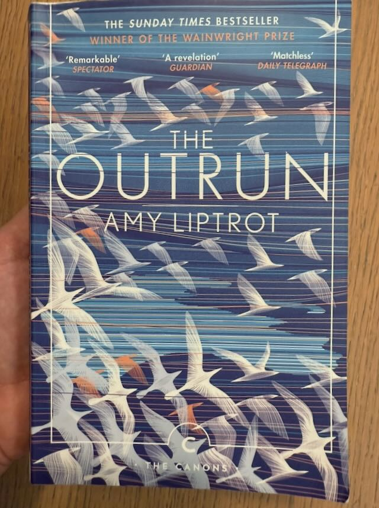

I went through the book quickly and really enjoyed it even if it started getting a bit bored at the end. It has a calming quality as it describes the life of an addict getting better through her experiences in nature - the archipelago of northern Scotland isles. Mostly about islands of Orkney and Papay, which I've now looked up in google maps.

It all starts with a painful description (not a memory - she was born on that day) of her father being taken away to a mental institution to the mainland. We then jump to a later time, where she escapes to London, and, as young people do (and older people would love to, but find reasons not to) lives a life with a feeling that things are waiting for her. 

Then comes her increasing struggles with alcohol. The addiction theme appears slowly but steadily, as the book first describes seemingly nice things but you know it's not gonna end well. The loneliness of the big city (even if the relation comes from perhaps being a "citizen of internet"), the feelings of being left behind as her group of friends moves on. The paradoxes of coming to big city to get to know different people, but in reality finding a safe group of identical ones. 

Later on there's a crisis and successfull rehab programme. Amy stumbles back to the islands, and, in her own words "just get's stuck", but this turns out to be a good thing. 

Back in the islands, she founds newfound joy in the simple way of life and the superficially simple landscapes, flora and fauna in there. And this in there, the main theme of the book appears, and what I initially liked about the book as I quickly flipped through it in the library. 

The writer describes the island mainly through experiences and how they make her feel, instead of directly describing the landscapes, which, at first sight, would probably look great but would get dull and empty and treeless (due to the extreme wind and saltiness, as the author says) quite quickly if just viewed superficially. 

Instead it seems Amy is able to notice an infinite stream of tiny happenings that accumulate into one big and great experience, and it is all described quite vividly. This I kind of relate to, as I find, for example, I'm able to ride the same bike route every day and never find it dull, while some strongly crave new routes. They will see more this is for sure, but the point here is that the difference in how it makes one feel on a different day is enough to make it feel new each day. Together with the smallest changes to the landscape, winds, skies itself which are always there if one looks for it. 

Not that she takes the same route though. She enrolls into a job of looking for rare island birds during the short northern nights and scouts an island for the species, square by square. She then looks at the stars, and thinks stuff like "asteroid Apophis which had been initially calculated to have a chance of ±2 percent to hit Earth is out there". She describes rituals involving large fires or simply fires burning trash on the islands, and the people themselves. She started walking, and took to finding meaning in it, started swimming in the sea which, at the temperatures and winds and waves I think to be a big effort. 

All the small things gradually help author fight the feeling that nothing is worthwile doing if you don't get drunk during it. I can somewhat relate to it too while to a lesser extent I guess, as I remember quitting smoking and losing the one nice quick thing you can do after any kind of activity. She had it worse though.. but managed to recover. 

I especially liked and resonated with one paragraph about how she found snorkeling in the islands uncovered a whole new world. I will paste this here, and end this with that.

```
Face down in shallow water, coated in neoprene and breathing through a tube, I feel as if I've opened a door that has always been in my house but I had never noticed. Life can be bigger and richer than I knew.
```



P.S. The publishers do a great job by adding first sections of her other books in the end of the book. While I found myself being tired of this one a bit at the end, after reading the start of next 2 ones, I'll probably get them too. 
