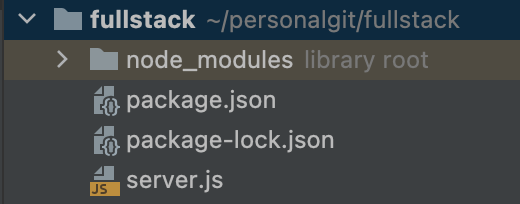
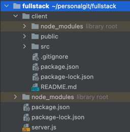

If you have a fullstack app where, say, landing routes are served using Express, and there's an inner "App" made using react, it's comfortable to develop both on the same port. Example scenario:

1) `http://localhost:3000/app` <- Create react app web development server configured with `"homepage": "app"` in `package.json`
2) `http://localhost:4000/api`  <- Express based API routes
3) `http://localhost:4000/landing` <- Express based static landing pages

Create react app has a proxy feature allowing us to seamlessly work on `http://localhost:3000/app` and access the API without any CORS issues. To configure it, add "proxy" to the CRA project's `package.json`:
```json
{
   ...,
   "homepage": "/app",
   "proxy": "http://localhost:4000" <-- add this
}
```

With this config, all requests made to `https://localhost:3000/api`, **except those containing `Accept: text/html` header**, will be proxied to `https://localhost:4000` (our backend server).

However, by design this proxying will not work for landing pages (note the `Accept: text/html` header exception). The alternative way to configure "proxy" for CRA - the `setupProxy.js` will not help in this case too. 

Instead, consider proxying the other way:
- Don't proxy CRA -> Express backend
- Proxy Express backend -> CRA

```js
// Express code
const request = require('request');

app.get("/app/*", function (req, res) {
    req.pipe(request(`http://localhost:3000${req.path}`)).pipe(res);
});
```

We take the `req` object, pipe it to the `request` library with makes identical request to another URL. Then the result is piped back to response. 

Our custom Express server has no limitations regarding any headers, so will successfully proxy the request.

## Full example and use case

Let's create a basic fullstack app. Obviously (but not so obviously when I was first starting 10 years ago..), you'll
need [Node](https://nodejs.org/en/download/). Begin by creating
an [Express Hello world app](https://expressjs.com/en/starter/hello-world.html).

### Express server

From inside directory `fullstack` (any name will of course work), set up a basic Express app + add `request` http client package:

```bash
npm install express request
```

This will generate a `package.json` file similar to this:

```json
// fullstack/package.json

{
  "dependencies": {
    "request": "^2.88.2",
    "express": "^4.17.2"
  }
}

```

Create a `server.js` file with the "Hello world" app contents:

```js
// fullstack/server.js

const express = require('express')
const app = express()
const port = 4000

app.get('/', (req, res) => {
    res.send('Hello World!')
})

app.listen(port, () => {
    console.log(`Example app listening on port ${port}`)
})
```

Your directory structure should look like this:



To test your Express app, from `fullstack` directory run:

```bash
node server.js
```

Visit [http://localhost:4000](http://localhost:4000), you should see "Hello world" text content returned by the Express server. Close the server by pressing `CTRL + C` in the terminal for now.

### Create react app "client" setup

From "fullstack" directory, create a React app called "client":

```bash
npx create-react-app client
```

Your directory "fullstack" should now look like this:



Configure CRA to have homepage of `/app`. This is not strictly required if you know what you're doing, but out of scope of this article.

```json
// fullstack/client/package.json
{
  ...,
  "homepage": "/app"
}                                               

```

Start the CRA dev server, from the `fullstack/client` directory:

```bash
npm run dev
```

Visit [http://localhost:3000/app](http://localhost:3000/app) and you should see a basic react template app.

### Configure Express proxy

Now we need to proxy `http://localhost:4000/app/*` to the CRA server running on port 3000. In `fullstack/server.js`
containing the "Hello world" Express code, add some lines:

```js
app.get("/app/*", function (req, res) {
    console.info(`Proxying to localhost:3000${req.path}`);
    req.pipe(request(`http://localhost:3000${req.path}`)).pipe(res);
});
```

Why `/app/*` with the wildcard, instead of just `/app` ? CRA will need to serve some static assets, like js files, stylesheets, favicons... Requests to all of them need to be proxied to the CRA dev server. 

### Testing it all out

The steps:
1) make sure your CRA dev server is still running by visiting http://localhost:3000/app (should open demo react app);
2) start the Express server again by running `node server.js` from the  `fullstack` directory, check if [http://localhost:4000](http://localhost:4000) is still showing "Hello world" message;
3. access [http://localhost:4000/app/hello](http://localhost:4000/app/hello).

In the 3rd step, what should  happen is:
1) Express will get a request to `http://localhost:4000/app/hello`
2) `get` handler for `http://localhost:4000/app/*` will catch it and run our proxying logic
3) `request` library will make request to `http://localhost:3000/app/hello`
4) CRA dev server will return index.html contents
5) the html contents will be piped to Express response
6) you will get the proxied react page, on the port of Express server

Hope this makes sense.
     
Further reading:

- [Express hello world](https://expressjs.com/en/starter/hello-world.html)
- [Create React App proxy](https://create-react-app.dev/docs/proxying-api-requests-in-development/)
- [A useful blog post about Node .pipe()](https://www.becomebetterprogrammer.com/what-does-pipe-mean-in-node-js-how-to-use-it-practical-guide/) 
- [More docs on .pipe() from nodejs.org](https://nodejs.org/en/knowledge/advanced/streams/how-to-use-stream-pipe/)

Have a great day, reader. End.  