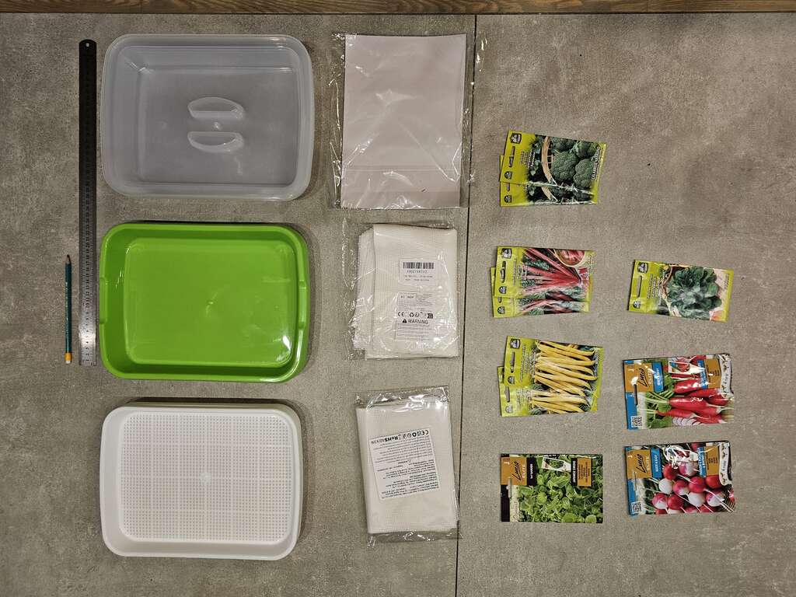
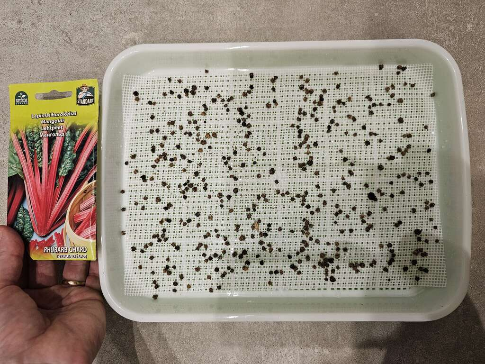
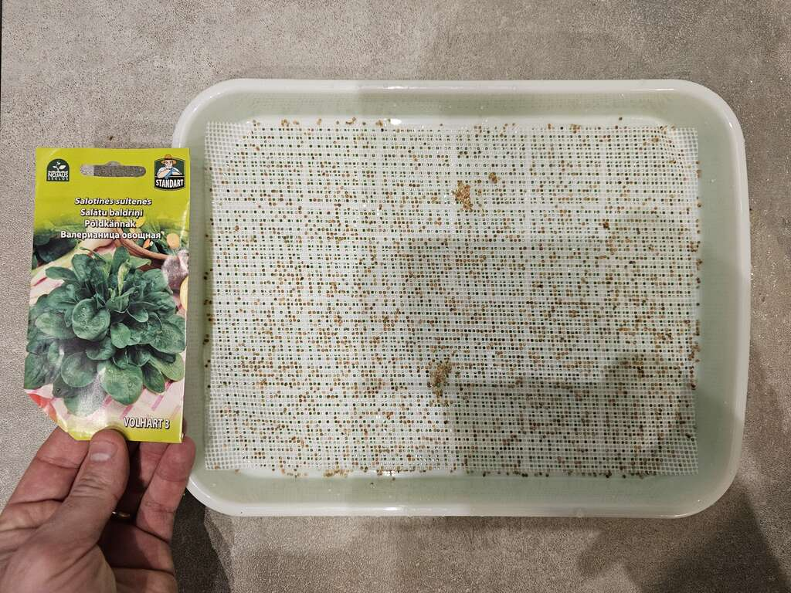
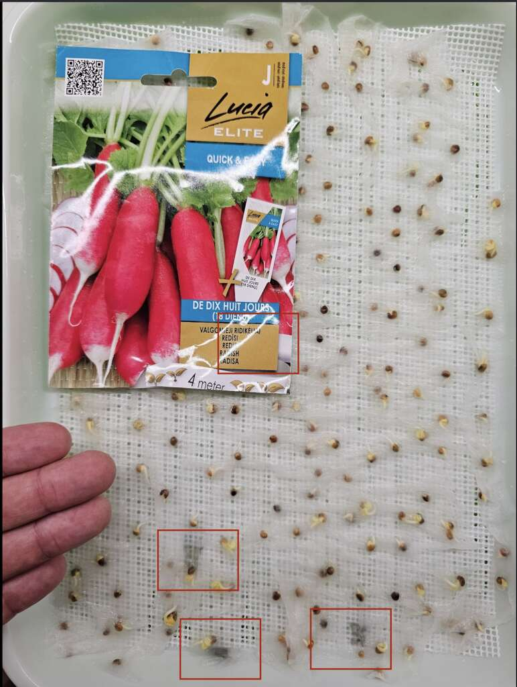
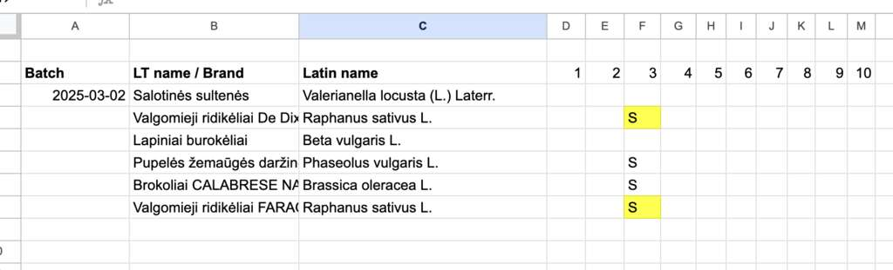
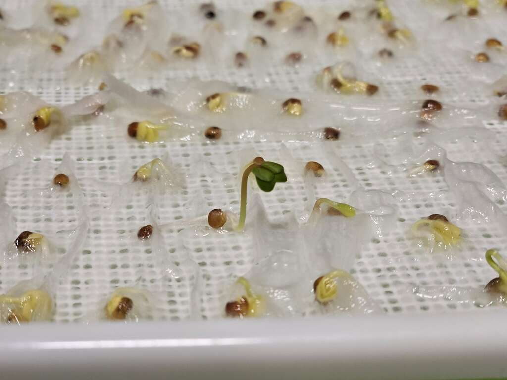
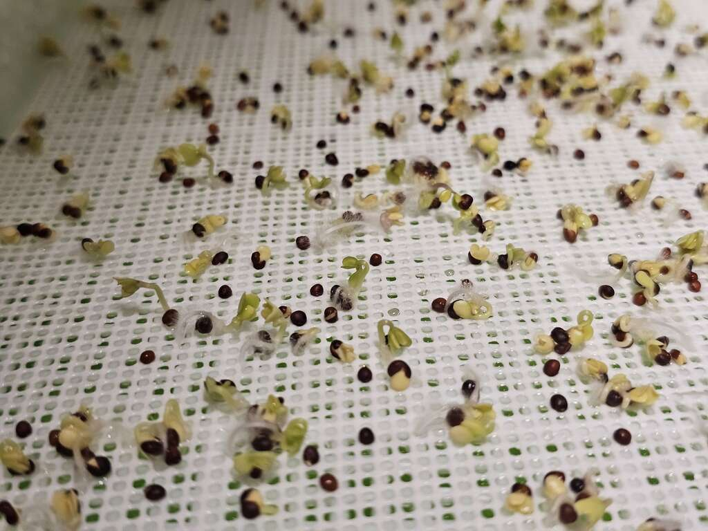

After wishing to grow microgreens for some time now, and looking into building all kinds of automated systems involving pumps and aerators, I've decided to start small. Hydroponics may be a bit of a strong word here, actually, but still - technically true. 

The beauty of microgreens - the tiny plants that get eaten at around 7 - 15 days of age - is that you really don't (should not, according to tutorials) need much.

- [(25 Eur) 6 hydroponics microgreen growing trays (generic, everybody sells them)](https://www.amazon.de/-/en/dp/B09NQZH19H)
- [(6 Eur) Silicone net used for drying vegetables](https://www.amazon.de/dp/B0DHKY6TX3)
- [(10 Eur) worth of regular seeds bought locally]

You fill up that plastic tray with water, and the seeds sprout roots that go down through plastic webbing, reaching the water. No other medium should be necessary (but we'll see). According to the tutorials, one could improve output by using hydroponics suitable fertilizer in the water, but it's not necessary since the greens are cut so early.

The trays are quite OK for the price. Made from 3 pieces - a bowl for the water, a plastic grid where you put the seeds and a lid for keeping moisture in. The plastic grid has holes which are too large for small seeds, this is where the silicone net comes in, keeping them from dropping through, but still allowing roots to pass through.

A few of the boxes were slightly deformed, with the center of the plastic netting bulging upwards, making seeds roll to the sides.

The silicone is already pre-cut and works perfectly with these trays at `[20cm, 28cm]` dimensions. For larger seeds, it's not needed. Definitely required for smaller ones.

Regular, basic seeds should be fine, just google the (big variety) of plants that can be consumed early on and don't have poisonous leaves etc. I actually accidentally bought some seeds for radishes nicely covered in a paper strip for easy planting. An extra pain here, but I've actually found the extra paper to hold moisture very well. 

I put 400ml of water into each bowl, put the seeds on top, sprayed them with a sprayer and closed the lids. I know it's recommended to compress the seeds and keep them dark for a few days (to emulate conditions under a layer of soil), but I've read they should do fine without the extra steps. 

When they sprout, I have a few lamps ready to shine on them for 16 hours a day (it's still early sprint here in Lithuania, it's dark). 

I'll update this post when they sprout. 

## Day 3 update

Beans, both varieties of radishes and brocolli have sprouted. For now the leaves are super small and yellow. I'll start using artificial lights tomorrow on them. I changed the water. The boxes had a weird, spicy smell in them (all of them), I'm slightly worried I should have changed the water in the box sooner - hopefully not a sign of some bacterial infestation yet. I'm spraying all the seeds with water every day. 

Worryingly, both radishes, which had their seeds wrapped in paper, developed what I believe to be small mold spots. I suspect this is due to the paper always being super wet. I manually removed the mold spots. I marked them with red rectangles in the photo. 

I'll see how this develops further. For now I've started tracking the sprouting (S) and problems (yellow background) in this table.

## Day 4 update

All have sprouted except for the smallest seeds of *Valerianella Locusta* (which I've thought would be the first). The plants remain moist, and seem to be doing well. No more mold growth (which was a surprise, maybe it wasn't mold after all?). I have decided to not change the water today as this would not be sustainable, and LLMs don't seem to think I need to. There was a spicy smell in most of the containers, yet I suspect this is actually the sprouts. 

