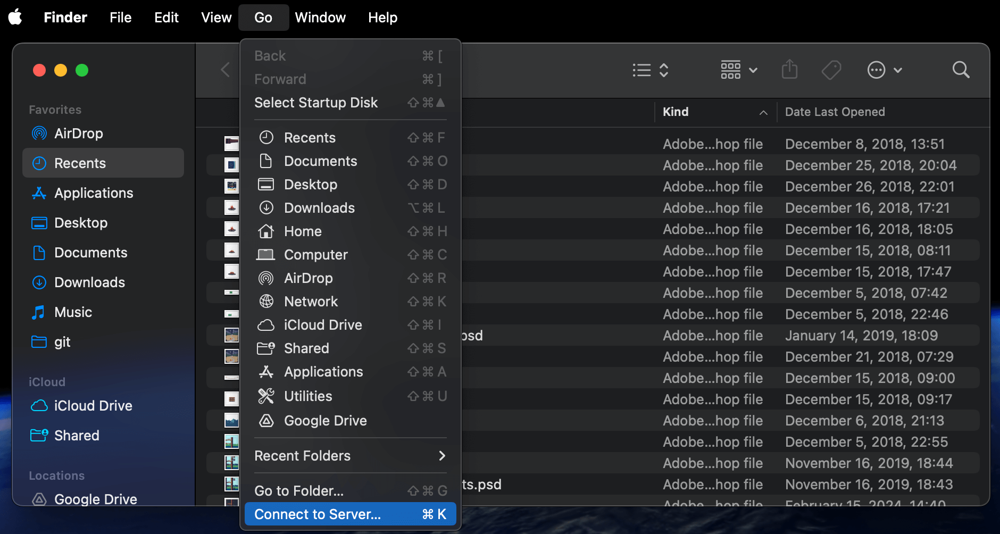

---
title: Transfer thousands of photos from android to mac via ftp
description: It's surprisingly difficult to do with most FTP programs being paid, and finder crashing due to 10s of thousands of files
layout: layout.html
tags: ["posts"]
date: 2025-05-29

Today I was preparing my old Samsung S23 Ultra for sale after moving to iOS for now. The app "Android transfer", which _kind of worked some of the time_ to transfer files from android to mac was no longer available though. The mac also refused to see the phone as a USB storage device despite multiple attempts to connect it (of course setting the phone to "USB / files transfer mode). The "media transfer" mode also did not work (while trying to import via "Photos" app on my mac). 

I then downloaded a [one](https://play.google.com/store/apps/details?id=com.medhaapps.wififtpserver&hl=en-US) of the many FTP server apps available for android. I was able to easily connect to the FTP server just by using "Finder" app:



However, the finder was super slow / crashed / lost connection to server often (due to 10's of thousands of images in the "DCIM/Camera" directory) and I was not able to transfer them successfully (apart from doing it manually in batches of like a 1000). 

I tried to download an FTP client and, to my horror, on the appstore, all were paid (and I don't really need FTP for anything else at this point) 

Fortunately, free options still exist, and ChatGPT wrote a script for me which uses `lftp`. To install via homebrew:

```bash
brew install lftp
```

Save this script `download-camera.sh`. I had problems with it being unable to create files / directories due to permissions / Apple "System integrity protection" stuff. So the script saves the results to your users home directory, which seemed to work (It will look like `/Users/yourusername/result`

```
#!/bin/zsh
set -euo pipefail

# ── connection details (of course match them with your android FTP config)
HOST="192.168.1.202"
PORT="2221"
USER="android"
PASS="yourpassword"
REMOTE_DIR="DCIM/Camera"

# ── target folder (flag or env var) ───────────────────────────────
LOCAL_DIR="${LOCAL_DIR:-$HOME/result}"
while getopts "d:" opt; do
[[ $opt == d ]] && LOCAL_DIR="$OPTARG"
done
LOG_FILE="$LOCAL_DIR/ftp-mirror.log"

mkdir -p "$LOCAL_DIR" 2>/dev/null || {
echo "❌  Cannot write to $LOCAL_DIR — choose another location" >&2
exit 1
}

# ── lftp batch ────────────────────────────────────────────────────
lftp -u "${USER}","${PASS}" -p "${PORT}" "${HOST}" <<EOF
# --- connection settings
set net:timeout 30
set net:max-retries 3
set cmd:fail-exit yes
set ftp:list-options -a
set xfer:clobber on

# --- show remote file list
cls -1 "$REMOTE_DIR"

# --- sequential mirror download
mirror --verbose \
--parallel=1 \
--use-pget-n=1 \
--log="$LOG_FILE" \
"$REMOTE_DIR" "$LOCAL_DIR"

bye
EOF

echo "✅  Finished. Files are in $LOCAL_DIR"
echo "   Transfer log: $LOG_FILE"
```

Make the script executable:
`chmod +x download-camera.sh` 

Run the script:
`./download-camera.sh` 

And it works - it sequentially downloaded the 25k of photos / videos over the few hours. I had to keep my phones screen on though, the FTP app seemed to go to sleep otherwise (I went to developer options of the phone, and selected "Keep screen on" option"). 

The models are truly becoming an UI for whatether you need - writing programs on the go. Cool but scary. 

Truly yours, as always,
Kasparas :) 