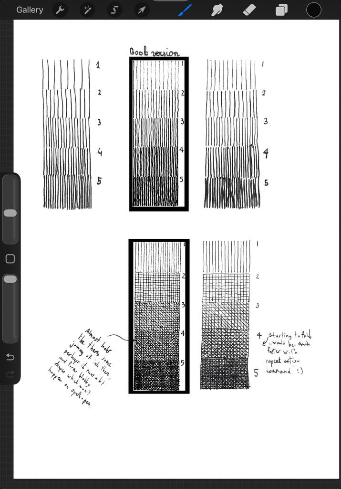
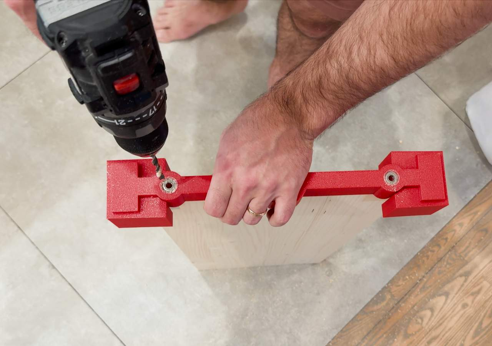
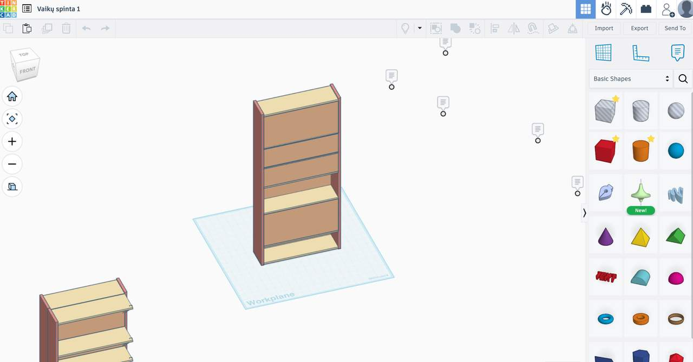

Today I was going through the [Ink drawing book](/books/2026-01/rendering-in-pen-and-ink/) I've just started. I can tell this is gonna be useful cause I'm encountering various textures and shading ways I'll want in my own illustrations already (mainly organic leaf shapes used for shading).

I was working on my ipad, cause that's the main tool (instead of real ink + pen) I'm gonna be using for the illustrations. A very cool book, also nicely written / illustrated. 

To see what I'm doing with this one could look into my other blog [sutemų dirbtuvės](https://sutemudirbtuves.lt) . 

---

I also learned a lot about real pens, nibs, ink. It's a world one could easily get lost in, as is the case with any truly useful instrument that is also a thing of beauty (if manufactured well). Specifically I was intrigued by "fude" type of pens which have bent tip allowing to get wide line not only by pressure, but also by rotating the nib. 

--- 

I also learned that my 3d printed modular tool designed for drilling straigh, well spaced holes in both walls and shelves... works wonders. However, the method itself - putting wooden dowels in the holes, adding glue to the shelf, and putting on some weight, does not work well.

 I knew this but was to lazy to aknowledge - One still needs to clamp, or to use screws to "pull" the wood pieces together, as the wooden dowels themselves are not enough even if you really hammer the pieces together. It will probably hold but I'm not proud. 

The 3d model of the cabinet itself was very easy to make with tinkercad, and learning tinkercad was well worth the time as it's a truly simple app to use.
I referred to it many times, and it saved me a lot of money and time after I understood that a much larger version of the shelf is best left... after building the first smaller one :) 

