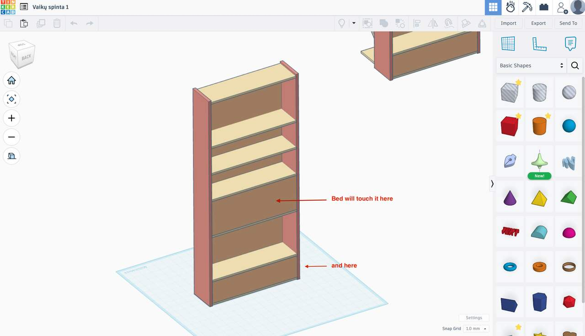
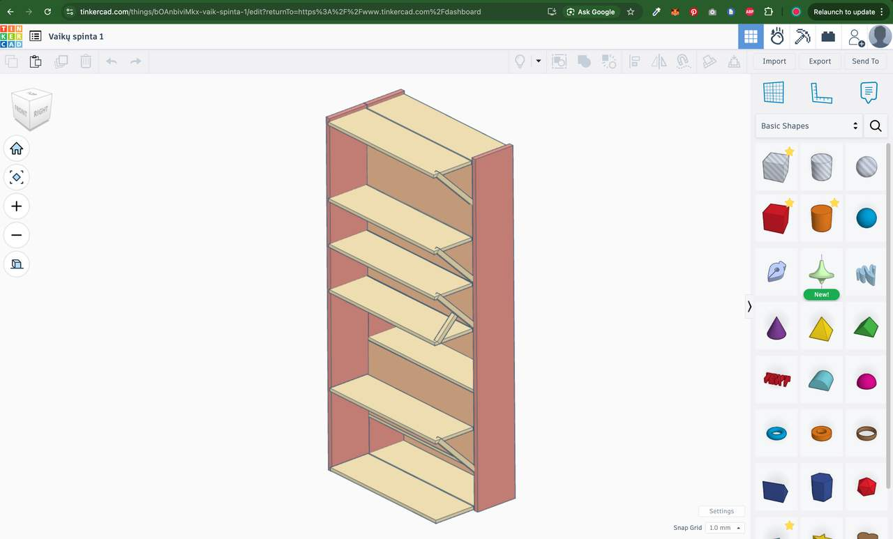

Our kids bet is a 2-story unit. It is positioned in a  leg-towards-the-door orientation which, kids said, was not very cozy as they see a black hole at their legs at night. Also it's ver un-feng-shui. 

They also read a lot of books, especially the bigger one. To remedy the situation I've decided to build custom shelving which would act as both a barrier and some nice storage. 

The thing is, if I just bought it, it would be oriented towards 1 single side (the non-wall side :) ). But, this would mean a lot of wasted space in my case. This is because the bed itself would obstruct a lot of the shelves.

I decided to use that obstructed space from the other side instead, so some books can be put in there too. 

Initially I thought of making it twice deeper and more complex. However, this would be so thick (60cm) that it would almost block the entrance to the room. 

All in all, it was really worth modelling the shelving. I was able to arrange available wooden panels I can buy from local shop without any need to cut them up before ordering them. Also it allowed me to visualize that the original shelve (the thick one) will probably not work. 

We'll see how it goes when I'll be building it now. 