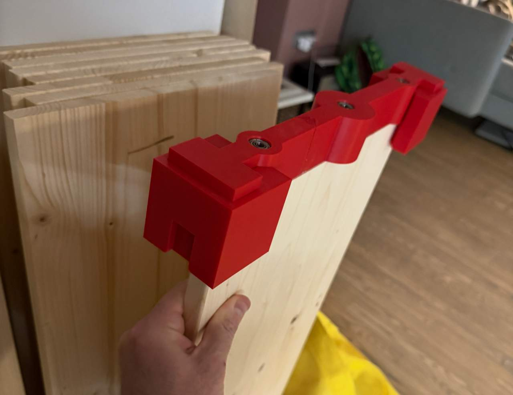

Today I had to solve a problem I knew I'll encounter when [building the shelves for my kids](/til/22_tinkercad-shelving). I'll need to drill a lot of holes (12 * 7 shelves), and they had to be perfectly aligned and straight because I was planning to use elegant wooden dowels and glue instead of screws or triangles with screws etc. to hold the shelves. 

I knew this was impossible (for me) to do by hand. Turns out all the 3d tinkering at tinkercad was really useful. 

The print went for 5 hours. The tool was too big to fit into the printer so I had to glue it from 2 parts with some epoxy. 

With the extra adapters the same tool can nicely used for the other orientation I need to drill holes in - this being the most precarious one. 

The result was really nice. We'll see if the holes align though when I'll be assembling the shelving unit!

